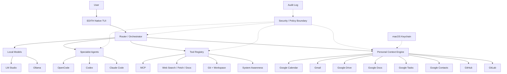

# EDITH CLI

[](https://github.com/MCVelasquez45/edith-cli/actions/workflows/test.yml)


Local-first AI orchestration from one terminal.

EDITH is a provider-agnostic terminal agent for coordinating local language models, specialist coding agents, MCP tools, web research, personal context, and Google Workspace from a single native CLI.

## Overview

EDITH runs locally on macOS and exposes a conversational terminal interface through `edith`. It discovers local model providers, routes work to the right local or specialist agent, applies security policy before tools run, and keeps personal context local by default.

The current milestone is an early infrastructure foundation. It is not a production-certified assistant, but the major integration paths have been verified end to end.

## Why EDITH

Most AI tooling is split across separate CLIs, cloud agents, local model servers, MCP servers, browser search, and personal productivity systems. EDITH acts as the coordinating layer:

- Local models remain useful for private synthesis.
- OpenCode remains the dedicated coding-agent TUI.
- Codex and Claude Code remain specialist agents.
- MCP tools are normalized behind one policy layer.
- Web access is a controlled tool, not unrestricted model network access.
- Google Workspace and personal context flow through confirmation and privacy boundaries.

## Architecture



Security boundaries include macOS Keychain storage, action confirmation, workspace path controls, MCP allowlists, SSRF protection, external-agent isolation, and audit logging.

## Features

- Native conversational terminal UI via `edith`
- Local model discovery and streaming through LM Studio and Ollama
- Dedicated coding mode via `edith code` and OpenCode
- Delegation to Codex, Claude Code, and OpenCode
- MCP client/server foundation with allowlisted tools
- General, current/news, official, documentation, and community web search modes
- Safe public web fetch with SSRF/private-network protections
- Google Workspace OAuth profiles with Keychain token storage
- Google Calendar, Gmail, Drive, Docs, Tasks, and Contacts connectors
- GitHub and GitLab read-only context
- Time-aware personal briefing engine
- Confirmation policy for sensitive, external, and destructive actions

## Quick Start

```bash
git clone git@github.com:MCVelasquez45/edith-cli.git
cd edith-cli
npm ci
npm test
node ./bin/edith.js --help
```

If the package is linked or installed globally:

```bash
edith
```

## CLI

Implemented commands include:

```bash
edith                 # launch native EDITH conversational TUI
edith code            # launch OpenCode specialist coding TUI
edith chat            # direct local-model chat
edith models          # live local model inventory
edith providers       # local provider health
edith agents          # specialist agent health
edith tools list      # normalized tool registry
edith doctor          # live diagnostics
edith context status  # personal-context connector status
edith auth status     # OAuth profile status
edith mcp status      # EDITH-owned MCP server status
```

Automation-oriented delegation is available through:

```bash
edith ask local "Reply with exactly OK"
edith ask codex "Review this repository"
edith ask claude "Review this plan"
edith ask opencode --auto "Inspect this repo"
```

## Example Session

```text
$ edith

EDITH
Local AI Orchestrator

qwen/qwen3-vl-4b · LM Studio
~/project · repo ~/project · main
agents OpenCode · Claude · Codex   tools ready

> What time is it?
● Checking local time
EDITH: The current time in your local timezone is ...

> Search the web for the latest developments in local AI.
● Searching web
● Fetching reuters.com
EDITH: ...
Sources:
1. ...

> What needs my attention in GitHub or GitLab?
● Checking GitHub/GitLab review context
EDITH: ...
```

## Local Models

EDITH discovers live models from:

- LM Studio at the configured local OpenAI-compatible endpoint
- Ollama at the local Ollama API endpoint

Embedding models are not presented as normal chat models. Capability labels are runtime-derived where EDITH can verify them.

See [Local Models](docs/LOCAL_MODELS.md).

## Agent Delegation

EDITH is the orchestrator. OpenCode, Codex, and Claude Code are specialist agents underneath it.

- `edith` launches EDITH's native agent UI.
- `edith code` hands the terminal to OpenCode for dedicated coding work.
- Natural or explicit requests can delegate to Codex, Claude Code, or OpenCode when appropriate.

Personal Google context is not automatically sent to external agents.

See [Agents](docs/AGENTS.md).

## MCP

EDITH implements MCP client/server foundations and uses allowlisted tools through the normalized Tool Registry. It does not automatically import every MCP server found on the machine.

See [MCP](docs/MCP.md).

## Web Research

Web access belongs to EDITH, not directly to local models. EDITH routes current-information requests through controlled search/fetch tools and passes retrieved public content to the local model for synthesis.

Configured providers:

- DuckDuckGo HTML search
- Official-source provider

Optional adapters:

- Brave Search API
- SearXNG

See [Web Search](docs/WEB_SEARCH.md).

## Google Workspace

EDITH supports local OAuth profiles for Google Workspace. Tokens are stored in macOS Keychain. The personal profile can access Calendar, Gmail, Drive, Docs, Tasks, and Contacts through confirmation-gated connectors.

No OAuth client secrets, access tokens, refresh tokens, or private Google data belong in Git.

See [Google Integration](docs/GOOGLE_INTEGRATION.md).

## Personal Context

The Personal Context Engine normalizes calendar events, messages, tasks, files, documents, contacts, GitHub/GitLab issues, and review requests. The briefing engine uses trusted local time and connected sources to produce on-demand briefs.

See [Personal Context](docs/PERSONAL_CONTEXT.md).

## Security Model

EDITH is designed around explicit boundaries:

- macOS Keychain for Google tokens
- OAuth credentials outside the repository
- confirmation policy for writes and destructive actions
- workspace-scoped file tools
- MCP allowlists
- public-web-only fetch with private-network blocking
- secret redaction in logs and session storage
- personal-context isolation from external agents by default

See [Security](docs/SECURITY.md) and [Privacy](docs/PRIVACY.md).

## Installation

Requirements:

- Node.js 20 or newer
- npm
- macOS for Keychain-backed Google token storage
- Optional local providers: LM Studio and Ollama
- Optional agents: OpenCode, Codex, Claude Code
- Optional CLIs for context: `gh`, `glab`

Development install:

```bash
npm ci
npm link
edith --version
```

## Configuration

EDITH keeps secrets out of Git. Runtime configuration may use local files under the user's config directory, environment variables, provider APIs, macOS Keychain, and EDITH-owned config.

Useful environment variables include optional search/provider settings such as `BRAVE_SEARCH_API_KEY`, `EDITH_SEARXNG_URL`, `EDITH_CODE_MODEL`, `EDITH_AUDIT_DIR`, and local Google OAuth client overrides.

See [Configuration](docs/CONFIGURATION.md).

## Development

```bash
npm ci
npm test
node ./bin/edith.js doctor
```

See [Development](docs/DEVELOPMENT.md) and [Contributing](CONTRIBUTING.md).

## Testing

The test suite uses Node's built-in test runner:

```bash
npm test
```

Live integration truth comes from:

```bash
edith doctor
```

## Project Structure

```text
bin/                 executable entrypoint
src/auth/            OAuth, token storage, action policy
src/context/         personal context connectors and briefing
src/network/         web search, fetch, docs, SSRF policy
src/mcp/             MCP client/server integration
src/agents/          OpenCode, Codex, Claude adapters
src/native/          EDITH native agent core and TUI
src/tools/           normalized tool registry and workspace tools
test/                unit and integration-style tests
docs/                engineering documentation
```

## Documentation

- [Architecture](docs/ARCHITECTURE.md)
- [Getting Started](docs/GETTING_STARTED.md)
- [CLI Reference](docs/CLI_REFERENCE.md)
- [Local Models](docs/LOCAL_MODELS.md)
- [Agents](docs/AGENTS.md)
- [MCP](docs/MCP.md)
- [Web Search](docs/WEB_SEARCH.md)
- [Google Integration](docs/GOOGLE_INTEGRATION.md)
- [Personal Context](docs/PERSONAL_CONTEXT.md)
- [Security](docs/SECURITY.md)
- [Privacy](docs/PRIVACY.md)
- [Troubleshooting](docs/TROUBLESHOOTING.md)
- [Roadmap](docs/ROADMAP.md)

## Roadmap

Near-term work:

- Harden installation and packaging
- Expand typed integration tests for live connectors
- Improve OpenCode non-interactive result contracts where upstream support allows
- Add richer policy UX for confirmed write actions
- Add optional provider configuration flows

Deferred:

- Calendar/email automation beyond confirmation-gated personal profile work
- Voice adapter
- Desktop/mobile/API interfaces
- OpenClaw integration

## Project Status

EDITH has reached the verified infrastructure milestone:

```text
EDITH FULL INFRASTRUCTURE: 100% VERIFIED
```

This repository remains an early-development foundation. `edith doctor` is the live source of truth for the current machine.

## License

No open-source license has been declared yet. The package is currently marked `UNLICENSED`.
