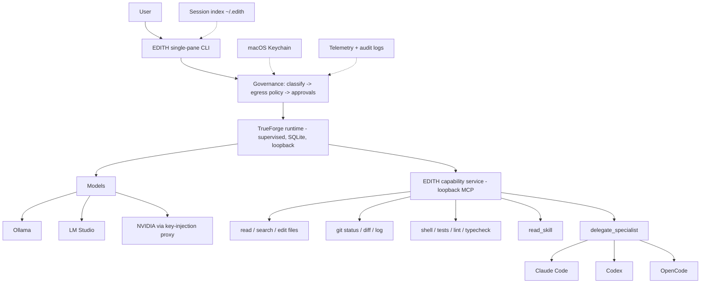

# EDITH CLI

[](https://github.com/MCVelasquez45/edith-cli/actions/workflows/test.yml)

[](LICENSE)

A local-first AI coding agent and assistant. One command opens the whole product:

```bash
$ edith
```

EDITH runs a real agent loop — reason → tool → observe → reason → answer — on your local models (Ollama, LM Studio), against your actual workspace, with persistent sessions, skills, human approvals for destructive actions, and a hidden, self-managed runtime. You never start servers, register providers, or manage tool registries.

Data governance is enforced ahead of every turn ([docs/HYBRID_PROCESSING.md](docs/HYBRID_PROCESSING.md)): SECRET data never leaves the machine, and cloud models only ever see PUBLIC-classified, sanitized payloads.

## Overview

`edith` detects your workspace (repo, branch, project type, commands, instructions), supervises its embedded TrueForge runtime, serves its coding tools over a loopback capability service, and drives everything through a single-pane terminal UX. Sessions survive restarts (`edith --continue`). Destructive actions pause for your approval. Ctrl+C cancels the current action, never your session.

Acceptance status: 33/34 gate capabilities PASS (the remaining one is a cloud live-turn blocked only on credentials) — see [docs/qa/EDITH-E2E-PRODUCT-GATE.md](docs/qa/EDITH-E2E-PRODUCT-GATE.md).

## Why EDITH

Most AI tooling is split across separate CLIs, cloud agents, local model servers, MCP servers, browser search, and personal productivity systems. EDITH acts as the coordinating layer:

- Local models remain useful for private synthesis.
- OpenCode remains the dedicated coding-agent TUI.
- Codex and Claude Code remain specialist agents.
- MCP tools are normalized behind one policy layer.
- Web access is a controlled tool, not unrestricted model network access.
- Google Workspace and personal context flow through confirmation and privacy boundaries.

## Architecture



Full details in [docs/ARCHITECTURE.md](docs/ARCHITECTURE.md).

Security boundaries include macOS Keychain storage, action confirmation, workspace path controls, MCP allowlists, SSRF protection, external-agent isolation, and audit logging.

## Features

- Real agent loop on local models: multi-step reasoning with live tool calls, token streaming, and visible activity
- Coding toolset with safety classes — READ auto-runs, WRITE follows policy, DESTRUCTIVE requires your approval
- Persistent sessions: `edith --continue`, `edith --resume <id>`, `edith sessions`; conversations survive restarts and context compacts automatically
- Workspace awareness: repo, branch, project type, package manager, test/lint commands, `EDITH.md`/`AGENTS.md` instructions
- Skills (`SKILL.md`) in core, user (`~/.edith/skills`), and workspace (`.edith/skills`) tiers, loaded on demand
- Specialist delegation to Claude Code, Codex, and OpenCode — agent-chosen or direct (`edith ask`, `edith code`)
- Ctrl+C cancels the current action and preserves the session
- Headless mode for scripts and CI: `edith run --json -p "<task>"`
- Self-managed runtime: auto start/health/reuse/recovery; `edith doctor` diagnoses everything with fixes
- Local-first security: SECRET never leaves the machine; cloud is PUBLIC-only and sanitized; provider keys are injected at request time and never persisted by the runtime; Keychain-backed Google auth
- Web research, Google Workspace connectors, and personal context preserved from earlier milestones (read-only, policy-gated)

## Quick Start

```bash
git clone git@github.com:MCVelasquez45/edith-cli.git
cd edith-cli
npm ci
npm test
node ./bin/edith.js --help
```

If the package is linked or installed globally:

```bash
edith
```

## CLI

Implemented commands include:

```bash
edith                 # open the interactive agent
edith --continue      # resume the latest session in this workspace
edith --resume <id>   # resume a specific session
edith --model <name>  # start on a model or class (local-fast, coding, ...)
edith --strict        # approvals for write operations too
edith run -p "<task>" # one headless agent turn (add --json for JSONL)
edith sessions        # list sessions for this workspace
edith runtime status  # background runtime health (also: stop | restart)
edith doctor          # diagnostics with remediation
edith code            # launch OpenCode specialist coding TUI
edith chat            # direct local-model chat
edith models          # live local model inventory
edith tools list      # agent toolset with safety classes
edith context status  # personal-context connector status
edith auth status     # OAuth profile status
edith mcp status      # EDITH-owned MCP server status
```

Inside a session: `/help /model /sessions /new /skills /tools /status /context /details /verbose /doctor /exit`.

Automation-oriented delegation is available through:

```bash
edith ask local "Reply with exactly OK"
edith ask codex "Review this repository"
edith ask claude "Review this plan"
edith ask opencode --auto "Inspect this repo"
```

## Example Session

Real transcript shape (from the acceptance E2E run):

```text
$ edith

EDITH   ~/project   main   local · qwen3-8b
────────────────────────────────────────────
Ask anything, or / for commands.

> Find why the tests are failing and fix the code. Re-run to confirm.

● Thinking…
● Running tests
  $ npm test
  1 failed, 1 passed
● Read src/cart.js
● Edit src/cart.js
  Edited src/cart.js (1 replacement, line delta +0)
● Running tests
  $ npm test
  2 passed

The failure was an incorrect calculation in cartTotal() — price minus
quantity instead of price times quantity. Fixed and all tests pass.
✓ Done

> Delete old-data.txt

■ Approval required
  delete_file {"path":"old-data.txt"}
  Allow? [y/N]
```

## Local Models

EDITH discovers live models from:

- LM Studio at the configured local OpenAI-compatible endpoint
- Ollama at the local Ollama API endpoint
- NVIDIA NIM at the configured OpenAI-compatible endpoint when `NVIDIA_API_KEY` is set

Embedding models are not presented as normal chat models. Capability labels are runtime-derived where EDITH can verify them.

See [Local Models](docs/LOCAL_MODELS.md).

## Agent Delegation

EDITH is the orchestrator. OpenCode, Codex, and Claude Code are specialist agents underneath it.

- `edith` launches EDITH's native agent UI.
- `edith code` hands the terminal to OpenCode for dedicated coding work.
- Natural or explicit requests can delegate to Codex, Claude Code, or OpenCode when appropriate.

Personal Google context is not automatically sent to external agents.

See [Agents](docs/AGENTS.md).

## MCP

EDITH implements MCP client/server foundations and uses allowlisted tools through the normalized Tool Registry. It does not automatically import every MCP server found on the machine.

See [MCP](docs/MCP.md).

## Web Research

Web access belongs to EDITH, not directly to local models. EDITH routes current-information requests through controlled search/fetch tools and passes retrieved public content to the local model for synthesis.

Configured providers:

- DuckDuckGo HTML search
- Official-source provider

Optional adapters:

- Brave Search API
- SearXNG

See [Web Search](docs/WEB_SEARCH.md).

## Google Workspace

EDITH supports local OAuth profiles for Google Workspace. Tokens are stored in macOS Keychain. The personal profile can access Calendar, Gmail, Drive, Docs, Tasks, and Contacts through confirmation-gated connectors.

No OAuth client secrets, access tokens, refresh tokens, or private Google data belong in Git.

See [Google Integration](docs/GOOGLE_INTEGRATION.md).

## Personal Context

The Personal Context Engine normalizes calendar events, messages, tasks, files, documents, contacts, GitHub/GitLab issues, and review requests. The briefing engine uses trusted local time and connected sources to produce on-demand briefs.

See [Personal Context](docs/PERSONAL_CONTEXT.md).

## Security Model

EDITH is designed around explicit boundaries:

- macOS Keychain for Google tokens
- OAuth credentials outside the repository
- confirmation policy for writes and destructive actions
- workspace-scoped file tools
- MCP allowlists
- public-web-only fetch with private-network blocking
- secret redaction in logs and session storage
- personal-context isolation from external agents by default

See [Security](docs/SECURITY.md) and [Privacy](docs/PRIVACY.md).

## Installation

Requirements:

- Node.js 20 or newer
- npm
- macOS for Keychain-backed Google token storage
- Optional local providers: LM Studio and Ollama
- Optional agents: OpenCode, Codex, Claude Code
- Optional CLIs for context: `gh`, `glab`

Development install:

```bash
npm ci
npm link
edith --version
```

## Configuration

EDITH keeps secrets out of Git. Runtime configuration may use local files under the user's config directory, environment variables, provider APIs, macOS Keychain, and EDITH-owned config.

Useful environment variables include optional search/provider settings such as `BRAVE_SEARCH_API_KEY`, `EDITH_SEARXNG_URL`, `EDITH_CODE_MODEL`, `EDITH_AUDIT_DIR`, and local Google OAuth client overrides.

See [Configuration](docs/CONFIGURATION.md).

## Development

```bash
npm ci
npm test
node ./bin/edith.js doctor
```

See [Development](docs/DEVELOPMENT.md) and [Contributing](CONTRIBUTING.md).

## Testing

The test suite uses Node's built-in test runner:

```bash
npm test
```

Live integration truth comes from:

```bash
edith doctor
```

## Project Structure

```text
bin/                 executable entrypoint
src/app/             interactive single-pane app, turn rendering, headless mode
src/runtime/         TrueForge supervisor, API client, event model, models, key proxy
src/capability/      loopback MCP capability service and coding toolset
src/routing/         governance: request analysis and egress policy
src/sessions/        durable session index
src/workspace/       workspace detection and context
src/skills/          SKILL.md discovery and loading
skills/              bundled core skills
src/agents/          OpenCode, Codex, Claude adapters + delegation tool
src/auth/            OAuth, Keychain token storage, action policy
src/context/         personal context connectors and briefing
src/network/         web search, fetch, docs, SSRF policy
src/mcp/             MCP client/server for external hosts
src/providers/       direct local-model utilities (chat, models, doctor)
test/                unit, integration, and contract tests
docs/                engineering and product documentation
```

## Documentation

- [Architecture](docs/ARCHITECTURE.md)
- [Getting Started](docs/GETTING_STARTED.md)
- [CLI Reference](docs/CLI_REFERENCE.md)
- [Local Models](docs/LOCAL_MODELS.md)
- [Agents](docs/AGENTS.md)
- [MCP](docs/MCP.md)
- [Web Search](docs/WEB_SEARCH.md)
- [Google Integration](docs/GOOGLE_INTEGRATION.md)
- [Personal Context](docs/PERSONAL_CONTEXT.md)
- [Security](docs/SECURITY.md)
- [Privacy](docs/PRIVACY.md)
- [Troubleshooting](docs/TROUBLESHOOTING.md)
- [Roadmap](docs/ROADMAP.md)

## Roadmap

Near-term work:

- Harden installation and packaging
- Expand typed integration tests for live connectors
- Improve OpenCode non-interactive result contracts where upstream support allows
- Add richer policy UX for confirmed write actions
- Add optional provider configuration flows

Deferred:

- Calendar/email automation beyond confirmation-gated personal profile work
- Voice adapter
- Desktop/mobile/API interfaces
- OpenClaw integration

## Project Status

EDITH has completed its end-to-end product build: a TrueForge-backed agent loop, persistent sessions, skills, approvals, interrupts, and a single-pane CLI, with the legacy regex-router architecture fully retired.

Acceptance gate (2026-08-22): **33 PASS / 1 PARTIAL** (cloud live-turn, blocked only on credentials) — [docs/qa/EDITH-E2E-PRODUCT-GATE.md](docs/qa/EDITH-E2E-PRODUCT-GATE.md). Regression suite: 148/148. `edith doctor` is the live source of truth for the current machine.

## License

EDITH CLI is released under the [MIT License](LICENSE).
