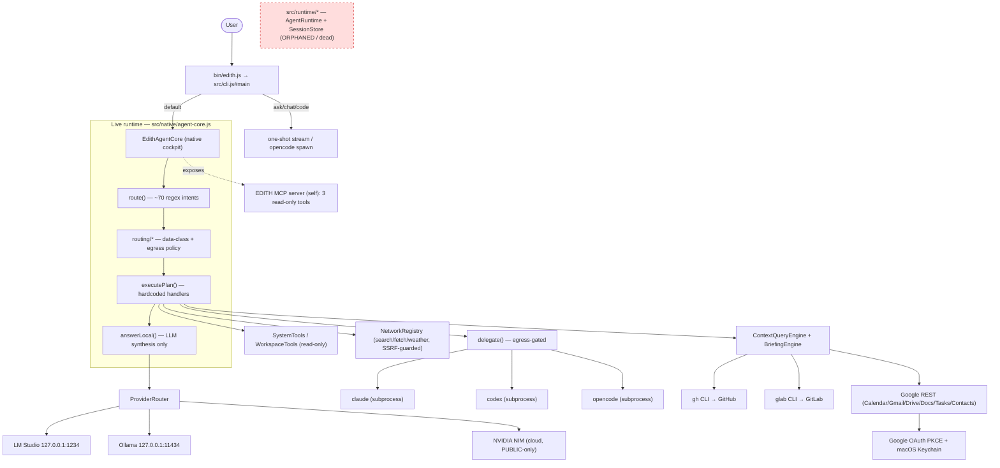

# CURRENT AGENT ARCHITECTURE — EDITH CLI

_Last updated: 2026-08-22 · Evidence-based audit of `/Users/markvelasquez/orca/edith-cli` (`src/` ≈ 7,800 LOC, Node ≥20, ESM). Every claim below is traced to a file and symbol. Items that could not be verified are marked `UNVERIFIED`._

> **Scope note.** EDITH CLI is a **standalone, local-first assistant/coding terminal**. It is not part of any fundraiser or downstream product repo. This document describes only what is actually in this repository.

---

## 1. What EDITH actually is

A single-process Node.js CLI whose default behavior is a **conversational TUI** ("native cockpit"). It is **local-first**: it prefers local models (LM Studio / Ollama) and read-only tools, applies a data-classification + egress policy before any cloud call, and delegates heavier coding work to **external agent CLIs** (Claude Code, Codex, OpenCode) as subprocesses.

EDITH is **not** a model-driven tool-calling agent. Its "runtime" is a **deterministic regex intent router** that maps each user message to one of ~70 hardcoded routes, runs the code for that route (which may call a tool or connector), and then uses the LLM only for **final text synthesis**. The model never chooses tools.

| Dimension | Reality | Evidence |
| --- | --- | --- |
| Entry point | `bin/edith.js` → `src/cli.js#main` | `bin/edith.js:2` |
| Default command | `native` → `runNativeEdith` (the cockpit) | `src/cli.js:24,30` |
| Real runtime class | `EdithAgentCore` | `src/native/agent-core.js:25` |
| Agent loop style | Regex router → hardcoded handlers → LLM synthesis | `agent-core.js:155` (`route`), `:228` (`executePlan`), `:828` (`answerLocal`) |
| Model-driven tool calling | **None** — tools are invoked by EDITH code, not chosen by the model | `agent-core.js:560-590` |
| Session persistence (shipping path) | **None** — in-memory history, pruned to 24 messages | `agent-core.js:22,29,932` |
| Providers | LM Studio, Ollama, NVIDIA NIM | `src/providers/index.js:7` |
| External coding agents | Claude Code, Codex, OpenCode (subprocess) | `src/agents/registry.js:6` |
| Dependencies | `@modelcontextprotocol/{client,server}`, `zod` only | `package.json` |

---

## 2. Command surface (`src/cli.js#main`)

`main(args)` is a flat dispatch on `args[0]`:

| Command | Handler | Notes |
| --- | --- | --- |
| _(none)_ / `native` / `--model` | `runNativeEdith` | Default conversational cockpit (`EdithAgentCore`) |
| `ask <local\|claude\|codex\|opencode>` | `runAsk` | `local` = one-shot stream, **no tools** (`cli.js:267-274`); others delegate to subprocess |
| `chat` | `runChat` | Direct streaming REPL, no tools/routing |
| `code` | `runCode` | `spawn('opencode', ['--model', …])`, `stdio:'inherit'` (`cli.js:113`) |
| `doctor` | `runDoctor` | Diagnostics |
| `auth google …` | `runAuth` | Google OAuth (`cli.js:137`) |
| `context status` | `runContext` | Read-only connector status |
| `mcp <status\|list\|tools\|…>` | `runMcp` | EDITH-owned MCP only; `add/remove` intentionally throw (`cli.js:317`) |
| `tools list` | `runTools` | Prints the tool **catalog** (metadata) |
| `providers` / `models` | via `createProviderRouter` | Live inventory/health |
| `mcp-server` | `serveEdithMcpStdio` | Runs EDITH as an MCP stdio server |

---

## 3. The real runtime: `EdithAgentCore` (`src/native/agent-core.js`)

### 3.1 Request lifecycle

```
handleUserMessage(input)                     agent-core.js:118
  → history.push(user); pruneHistory()        (MAX_MESSAGES = 24)
  → plan = route(userText)                     :155  regex intent classifier (~70 patterns)
  → executionPlan = createExecutionPlan(...)   routing/planner.js  (data-class + egress governance)
  → audit.record('processor_selected')         audit.js
  → result = executePlan(plan, ...)            :228  big if/else dispatch to a handler per route
  → history.push(assistant, result.text)
```

### 3.2 `route()` — the intent classifier (`agent-core.js:155-226`)

~70 ordered regular expressions map the message to a route string, e.g. `system:time`, `context:events`, `context:brief`, `network:search`, `network:weather`, `workspace:git`, `agent:claude`, `agent:opencode`, falling through to `local` (general conversation). This is the closest thing EDITH has to a planner. It is **string-pattern based**, not model-based, so capability is bounded by the regex set.

### 3.3 `executePlan()` — hardcoded handlers (`agent-core.js:228-269`)

Each route has a dedicated `answer*` method. Categories:

- **System** (`system:time/date/timezone/info`) → `SystemTools` (`native/system-tools.js`).
- **Workspace** (`workspace:git/branch/repo/cwd`) → `WorkspaceTools` (`native/workspace-tools.js`), read-only, boundary-enforced (`tools/path.js`).
- **Personal context** (`context:*`) → `ContextQueryEngine` / `BriefingEngine` over connectors (§7).
- **Network** (`network:search/docs/fetch/weather`) → `NetworkRegistry` (`network/providers.js`), SSRF-guarded (`network/policy.js`).
- **Delegation** (`agent:claude/codex/opencode`) → `delegate()` (§6), egress-gated.
- **Local** → `answerLocal()` streams the current model with a capability-manifest system prompt.

### 3.4 LLM usage is synthesis-only (`answerLocal`, `agent-core.js:828`)

The model receives: a system prompt with a runtime "capability manifest" (`:864`), the last 10 history turns, and any tool/connector output as "Approved context". It streams a reply with a pathological-repetition guardrail (`wouldRepeatPathologically`, `:1029`). **The model is never given tool schemas and cannot call tools.**

---

## 4. The SECOND (dead) runtime — `src/runtime/*`

There is an **entirely separate, orphaned runtime** that looks like an earlier design:

| File | Class | Status |
| --- | --- | --- |
| `src/runtime/agent.js` | `AgentRuntime` — a plan→execute→respond loop, `maxIterations=6`, `/resume` support, edit proposals | **Orphaned** — imported by **no `src/` file**, only tests |
| `src/runtime/session.js` | `SessionStore` — JSON persistence to `~/.edith/sessions/*.json` + `latest-<hash>.txt`, secret redaction | **Orphaned** — importer is only `test/session.test.js` |
| `src/runtime/context.js` | conversation context helper for `AgentRuntime` | **Orphaned** |

Verified via grep: no non-test importer of `runtime/agent`, `runtime/session`, or `runtime/context`. **The shipping product's session persistence is therefore this dead code — the live cockpit persists nothing.** This is the single largest piece of dead infrastructure in the repo and the clearest "duplicate runtime" finding.

---

## 5. Model providers & routing

### 5.1 Provider router (`src/providers/index.js`)

`ProviderRouter` wraps three providers, all **direct REST**:

| Provider | Class | Endpoint | Auth |
| --- | --- | --- | --- |
| LM Studio | `LMStudioProvider` | `http://127.0.0.1:1234` (`/v1/*`, OpenAI-compatible) | none (`apiKey:"local"`) |
| Ollama | `OllamaProvider` | `http://127.0.0.1:11434` (`/api/*`) | none |
| NVIDIA NIM | `NvidiaProvider` | `https://integrate.api.nvidia.com/v1` | `Bearer NVIDIA_API_KEY` |

`refresh()` lists models per provider; `selectInitial()` prefers the verified local coding model `lm-studio/qwen/qwen3-vl-4b`; `stream()`/`complete()` proxy to `provider.streamChat`.

### 5.2 Governance layer (`src/routing/*`) — EDITH's distinctive asset

This is real, EDITH-specific IP that most agent harnesses do **not** have:

- `request-analysis.js` — `analyzeRequest()` (capability detection) and `classifyData()` → `DataClass` = `PUBLIC | LOCAL | PERSONAL | SENSITIVE | SECRET`.
- `egress-policy.js` — `egressDecision()`: `SECRET` never leaves the machine; non-local processors require **PUBLIC-only** input; `local-first` mode forbids any external processor except the single approved `nvidia:z-ai/glm-5.2`. `sanitizeExternalPayload()` redacts before any egress.
- `planner.js` — `createExecutionPlan()` builds steps + processor selection + egress verdicts; forces `finalProcessor` local whenever any `PERSONAL/LOCAL/SENSITIVE` class is present.
- `processor-registry.js` — flattens providers+agents into a processor list with `location`/`privacy` flags.

> **Known duplication:** the approved external model id `'nvidia:z-ai/glm-5.2'` is hardcoded in both `egress-policy.js` and `planner.js`; `local-first` default appears in `config.js`, `egress-policy.js`, and `.env.example`.

---

## 6. External coding-agent delegation (`src/agents/*`)

`AgentRegistry` holds three adapters, each a **CLI subprocess** via `runProcess` (`agents/process.js`, `child_process.spawn`):

| Agent | Adapter | Invocation | State |
| --- | --- | --- | --- |
| Claude Code | `ClaudeAdapter` | `claude --print --output-format json --permission-mode dontAsk --tools '' --no-session-persistence` | stateless per call |
| Codex | `CodexAdapter` | `codex exec --json` (sandbox read-only) | stateless per call |
| OpenCode | `OpenCodeAdapter` | `opencode run --format json --model … [--auto]` | keeps **its own** sessions |

Delegation is governed: `delegate()` (`agent-core.js:592`) re-classifies data and **blocks** if `SECRET/PERSONAL/SENSITIVE` is present, sanitizes the payload, audits, then shells out. **Important:** once delegated, these agents use their **own** model config, MCP config, and credentials — EDITH cannot observe or constrain them (see Inventory).

---

## 7. Personal-context connectors (`src/context/*`)

`ContextConnectorRegistry` exposes read-only connectors; `ContextQueryEngine` + `BriefingEngine` normalize and synthesize. Access mechanisms (verified):

| Source | Connector | Mechanism |
| --- | --- | --- |
| GitHub | `github.js` `GitHubConnector` | **`gh` CLI subprocess** (`gh api …`), strips `GITHUB_TOKEN`/`GH_TOKEN` |
| GitLab | `gitlab.js` `GitLabConnector` | **`glab` CLI subprocess** (`glab api …`) |
| Google Calendar | `google-calendar.js` | **Direct REST** to `calendar/v3` — _own_ `googleRequest` (does NOT share `google-base.js`) |
| Google Gmail/Drive/Docs/Tasks/Contacts | `google-*.js` | **Direct REST** via shared `google-base.js#googleFetch` |

> **Two parallel Google REST client stacks** (`google-base.js#googleFetch` vs `google-calendar.js#googleRequest`) over the same OAuth provider — a real divergence risk.

**Not present in EDITH (searched, zero hits):** Salesforce, Slack, HubSpot. (Any Slack/HubSpot/Gmail MCP tools visible in the surrounding environment belong to the audit harness, not to EDITH.)

---

## 8. Authentication & secrets (`src/auth/*`)

- **Google OAuth**: hand-rolled OAuth 2.0 + PKCE loopback (`google-oauth.js#GoogleWorkspaceAuthProvider`) — direct `fetch` to Google auth/token/userinfo endpoints, `http.createServer` on `127.0.0.1:0` at `/oauth/google/callback`. **No `googleapis` SDK.**
- **Token storage**: macOS **Keychain** via `/usr/bin/security` subprocess (`token-store.js#KeychainTokenStore`, service `edith.google`). Non-secret metadata in `~/.config/edith/`.
- **Other secrets**: env only — `NVIDIA_API_KEY`, `BRAVE_SEARCH_API_KEY`, `EDITH_SEARXNG_URL`, optional `EDITH_GOOGLE_CLIENT_ID/_SECRET`.
- **GitHub/GitLab**: no EDITH-managed secret — delegated to `gh`/`glab` keyrings.

> **Duplication:** secret-redaction regex logic is reimplemented in ~6 places (`context/connectors/process.js`, `auth/token-store.js`, `native/workspace-tools.js`, `routing/egress-policy.js`, `runtime/session.js`, `audit.js`) with differing token patterns.

---

## 9. MCP (`src/mcp/*`)

EDITH is **both** an MCP client and an MCP server, but its footprint is minimal:

- **Client** (`client.js#EdithMcpClient`): connects to servers from `config.mcp.servers`, enforces a per-server `allowTools` allowlist, times out, audits. Transports: stdio + streamable HTTP.
- **Registry** (`registry.js`): only one server ships — `self` (`config.js:29`), a stdio server that re-launches `bin/edith.js mcp-server`.
- **Server** (`server.js#createEdithMcpServer`): exposes exactly **3 read-only tools** — `edith_status`, `list_local_models`, `ask_local_model` — plus one resource and one prompt.

EDITH **deliberately does not import** Claude/Codex/project MCP configs (`runMcpDiscover` probes `~/.claude.json`, `~/.codex/config.toml`, `./.mcp.json` but refuses to merge them — `cli.js:357`).

---

## 10. Tools (`src/tools/*`, `src/native/*-tools.js`)

Three **disjoint** tool surfaces, hand-kept in sync:

1. `tools/registry.js#createDefaultToolRegistry()` — declarative **catalog** with `risk`/`permissions` metadata (native + context + network tools). Metadata only, no implementations.
2. `native/workspace-tools.js` + `native/system-tools.js` — the **actual implementations** (filesystem/git/time/system), workspace-boundary enforced (`tools/path.js`), secret-file patterns blocked.
3. `mcp/server.js` — a third `zod`-schema tool surface for the MCP server.

`tools/policy.js` defines the shared `Risk` taxonomy (`READ_ONLY`, `WORKSPACE_READ`, `NETWORK`, `EXTERNAL_SERVICE`, …).

---

## 11. Sessions / state — summary

| Store | Path | Used by shipping path? |
| --- | --- | --- |
| `EdithAgentCore.history` (in-memory) | RAM, pruned to 24 msgs | **Yes** — this is the only live "session" |
| `SessionStore` JSON | `~/.edith/sessions/*.json` | **No** — orphaned/dead |
| OpenCode sessions | OpenCode's own store | Only when delegating to OpenCode |
| Claude/Codex | none (invoked stateless) | n/a |

Net: **up to four disjoint session notions, none shared**, and the persistent one is dead code.

---

## 12. Current architecture diagram



---

## 13. Strengths and structural problems (feeds the fit analysis)

**Genuine strengths (EDITH-specific, worth preserving):**
- Local-first **data-classification + egress governance** (`routing/*`) — uncommon and valuable.
- Read-only-by-default posture; writes/destructive actions confirmation-gated.
- Clean credential separation (GitHub/GitLab via `gh`/`glab` keyrings; Google in Keychain).
- Small, dependency-light footprint (2 runtime deps).

**Structural problems (independent of TrueForge):**
1. **Two runtimes** — `EdithAgentCore` (live) and `src/runtime/*` (dead). Dead code should be removed or revived deliberately.
2. **No real agent loop** — regex routing caps capability; the model can't call tools.
3. **No session persistence** in the shipping path (the persistent store is orphaned).
4. **Model/provider config duplicated across 6+ locations** with two provider-ID namespaces bridged only by an unused field.
5. **Four disjoint MCP registries** (EDITH, Claude, Codex, project) with no reconciliation.
6. **Three disjoint tool surfaces** kept in sync by hand.
7. **~6 divergent secret-redaction implementations.**
8. **Two parallel Google REST clients.**

These problems are enumerated with Keep/Migrate/Remove classifications in `AGENT-SYSTEM-INVENTORY.md` and `CLEANUP-PLAN.md`.
