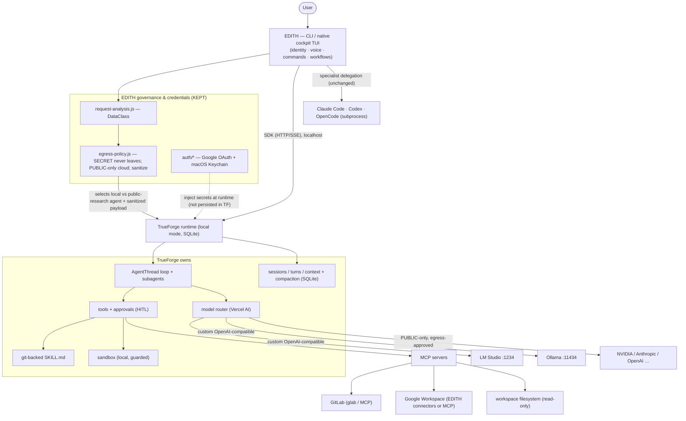

# TARGET AGENT ARCHITECTURE

_Last updated: 2026-08-22 · The end-state after adopting Option A (TrueForge as runtime under EDITH), gated on the local-model POC. See `TRUEFORGE-FIT-ANALYSIS.md` for the decision, `CLEANUP-PLAN.md` for the ordered migration, and `../product/EDITH-PRODUCT-MATURITY.md` for the evidence-based gap to production._

---

## 0. Product north star

The goal is **not** merely to integrate TrueForge into the existing EDITH CLI. The goal is:

> **Turn EDITH into a production-grade, local-first AI agent product that becomes the primary AI experience across Orca, using TrueForge as the underlying agent runtime wherever it improves the architecture.**

EDITH is the product. TrueForge, Claude Code, Codex, OpenCode, Ollama, LM Studio, and MCP are **capabilities behind it** — the user never chooses among them; EDITH does.

```text
User → EDITH → (context · agent · skill · tool · model · environment · approvals) → result
```

### 0.1 Product requirements that constrain every architecture decision

1. **Local-first is a product requirement, not a dev convenience.** A usable core experience must remain available when every cloud provider is down. The policy/router split (local execution vs cloud execution) is part of the product, which is why egress governance stays EDITH-owned (§3).
2. **Orca-wide, one platform.** EDITH must not be architected around one repository. There is one EDITH platform serving many workspace/project/general contexts — never a copy of EDITH per project.
3. **Workspace awareness via an explicit abstraction.** A session should know its workspace, repository, branch, available tools/skills, project instructions, configuration, preferences, history, and permissions — supplied through a workspace/context object, never hard-coded into the runtime.
4. **Conversation over commands.** The intelligence architecture is `conversation → persistent context → agent reasoning → capability discovery → selection → execution → observation → continued reasoning → response`. Commands survive as shortcuts only.
5. **Persistent personal agent.** `edith` opens an assistant that resumes appropriately — sessions, history, preferences, authorized memory, task/tool/approval history. Never "every process start = new assistant."
6. **Multiple interfaces, one runtime.** CLI, chat, and voice are surfaces over one EDITH core (TrueForge's HTTP/SDK boundary enables this). New surfaces must not rebuild agent logic.
7. **Capability-class model selection.** Users may pick a model, but the product-level abstraction is capability classes (Local Fast, Local Reasoning, Cloud Fast, Cloud Reasoning, Coding, Vision) mapped to providers/models behind the router. Not implemented in Sprint 1 — but Sprint 1 cleanup must converge on **one canonical provider/model representation** so this becomes possible.
8. **Enterprise-quality means** reliable, secure, maintainable, observable, testable, upgradeable, permission-aware, multi-workspace, production-quality. It does **not** mean Salesforce/HubSpot/Slack/CRM integrations — those are separate projects that later plug into this platform.

### 0.2 Ownership split (do not duplicate responsibilities)

| TrueForge owns | EDITH owns |
| --- | --- |
| agent execution loop | product identity, chat/voice/workspace experience |
| durable sessions, context lifecycle, compaction | user configuration, preferences |
| streaming | governance, data classification, egress policy |
| tool execution runtime, MCP runtime | security decisions, Keychain integration |
| skills runtime, subagents | provider eligibility, capability policy |
| approval mechanics, agent persistence | specialist delegation, product-level observability |

Specialists (Claude Code / Codex / OpenCode) become **engineering capabilities EDITH delegates to** — the user should not have to leave EDITH to use them, though direct access stays for power users.

### 0.3 Roadmap (revised, 11 sprints)

```text
S1  Foundation Cleanup            — remove duplication/dead architecture; no behavior change  ← CURRENT
S2  TrueForge Agent Runtime       — agent → reasoning → dynamic tool selection → execution → observation → response
S3  EDITH Runtime Cut-In          — TrueForge under the normal chat experience; rollback preserved
S4  Persistent EDITH              — durable sessions, resume, context, compaction
S5  Skills + Capability Registry  — modular capabilities replace regex handlers
S6  Workspace-Aware EDITH         — one platform across Orca workspaces; workspace context/config
S7  Security + Governance         — EDITH governance wrapped around TrueForge execution; approvals, scopes
S8  Specialist Delegation         — Claude Code / Codex / OpenCode as EDITH engineering specialists
S9  Product Experience            — unify chat/CLI/voice/sessions/agents/skills/models/activity/approvals/config
S10 Legacy Runtime Retirement     — remove regex router + duplicate infra, only after demonstrated parity
S11 Production Hardening          — reliability, diagnostics, releases, upgrades, migrations, recovery, observability
```

Release readiness is defined by measurable gates, not "100%" — see `../product/EDITH-PRODUCT-MATURITY.md`.

---

## 1. Design goals (one of each, where practical)

| Concern | Target owner | Rationale |
| --- | --- | --- |
| **One runtime / agent loop** | TrueForge | EDITH has no real loop; TF's is STABLE |
| **One session/state model** | TrueForge (SQLite local) | EDITH persists nothing today |
| **One tool protocol** | MCP (via TrueForge) | Collapses EDITH's 3 tool surfaces |
| **One skills system** | TrueForge git-backed `SKILL.md` | EDITH has none |
| **One model abstraction** | TrueForge providers (local = `custom` OpenAI-compat) | Collapses EDITH provider router + `opencode.local.json` |
| **One session store** | TrueForge DB | Retires dead `SessionStore` + in-memory-only cockpit |
| **One secrets strategy** | EDITH macOS Keychain (TF secrets injected at runtime, not persisted in TF) | TF has no at-rest encryption |
| **One governance point** | **EDITH** (egress/data-classification) | TF has no equivalent; must not be lost |
| **One config hierarchy** | defaults → workspace → env → user → runtime | Ends the 6-way model-config sprawl |

**Roles, unambiguous:**
- **EDITH** = product identity, CLI/TUI, voice/UX, business & personal workflows, **egress governance**, **Keychain auth**, external-agent delegation. EDITH is a **client + governor** of the runtime.
- **TrueForge** = runtime: agent loop, sessions, context/compaction, tools, skills, approvals, subagents, sandbox, model execution, streaming, HTTP API/SDK.
- **Claude Code / Codex / OpenCode** = specialist software-engineering agents, invoked as subprocess tools (unchanged).
- **MCP** = the single tool/integration protocol (GitLab/Google/etc. as MCP servers or EDITH connectors surfaced through MCP).

---

## 2. Target diagram



---

## 3. The governance contract (the one hard integration)

EDITH must remain the **policy decision point** even though TrueForge runs the loop. Concretely:

1. On each request EDITH runs `classifyData()` → `DataClass`.
2. EDITH maps the class to a **TrueForge agent**:
   - `SECRET` / `PERSONAL` / `SENSITIVE` / `LOCAL` → a TF agent bound to a **local** model provider (Ollama/LM Studio). Payload never leaves the machine.
   - `PUBLIC`-only + research → optionally a TF agent bound to an approved cloud provider, **after `sanitizeExternalPayload()`**.
3. EDITH injects only the credentials the chosen agent needs, at runtime, from Keychain — TrueForge never persists them (mitigates TF's no-encryption-at-rest gap).
4. TF's per-agent single-model design makes this a natural fit: "local agent" vs "public-research agent" are just two TF agents; EDITH chooses which to call. **One runtime, one governor — not two loops.**

This is why the recommendation is Option A, **not** the hybrid Option C: there is exactly one agent loop (TF) and one policy layer (EDITH) in front of it.

---

## 4. Configuration hierarchy (ends the 6-way sprawl)

```
EDITH defaults      (src/config.js defaultConfig)
   ↓ overrides
machine config      (per-host: endpoints, hardware, EDITH_* env vars)
   ↓
user config         (~/.config/edith/config.json)
   ↓
workspace config    (project-level, e.g. ./.edith.json)
   ↓
session overrides   (--model, session flags)
```

Provider/model/tool configuration must live in this hierarchy, never scattered through source code.

- Local model endpoints (LM Studio :1234, Ollama :11434) declared **once** and fed to **both** EDITH and TrueForge (TF `custom` provider registration derived from EDITH config), retiring the duplicate declarations in `opencode.local.json`, `providers/*`, `.env.example`, `mcp/server.js`, etc.
- Secrets stay **out of version control** and out of TF's DB — Keychain + env only.

---

## 5. What stays EDITH-native (not moved to TrueForge)

| Component | Why it stays |
| --- | --- |
| `bin/edith.js`, `src/cli.js`, native cockpit TUI | Product identity & UX |
| `src/routing/request-analysis.js`, `egress-policy.js` | Governance — TF has no equivalent |
| `src/auth/*` (Google OAuth + Keychain) | TF has no at-rest secret encryption |
| `src/agents/*` (Claude/Codex/OpenCode) | Specialist SE agents, different role |
| `src/context/connectors/*` | Read-only personal context (kept, or re-exposed as MCP) |
| `src/audit.js` | Local audit trail (consolidate format with TF logging) |

## 6. What TrueForge takes over

`AgentThread` loop · sessions/turns/context + compaction · tool registry + approvals · skills · subagents · sandbox · model execution/routing · streaming · HTTP API/SDK · structured logging + tracing hooks.

## 7. Non-goals

- No hosted mode (Postgres/Redis/Docker/Helm) for local EDITH — **local/standalone SQLite only**.
- No cloud sandbox (Daytona) by default — local sandbox, guarded, or none.
- No TrueForge web UI as EDITH's primary surface — the cockpit TUI stays; the SPA is optional/secondary.
- Do **not** route Claude/Codex/OpenCode through TrueForge — they remain subprocess specialists.
